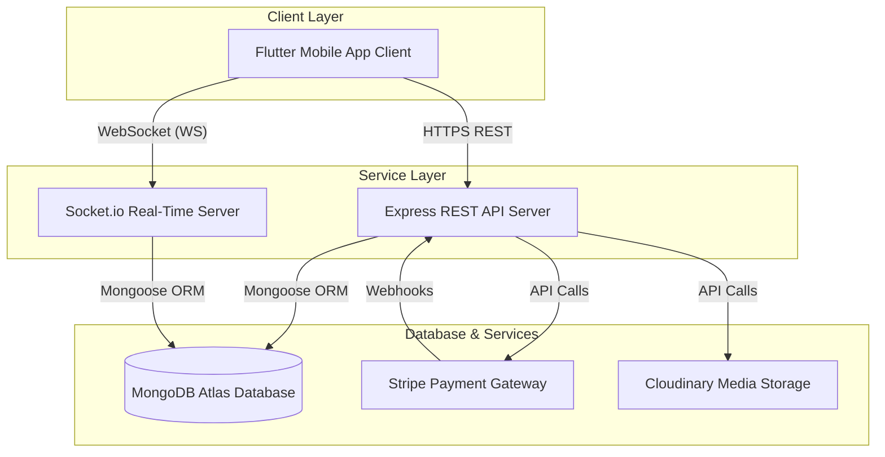
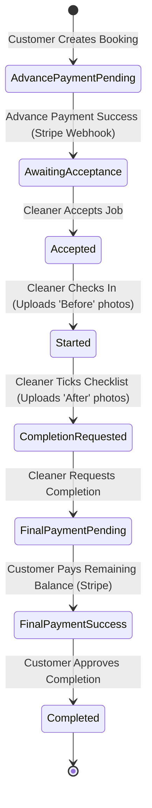

# Shaturajones Service Marketplace - System Design Document

This document describes the end-to-end system design, architecture, and maintenance guidelines for both the **Backend API (Node.js/Express/TypeScript/Mongoose)** and the **Frontend Client (Flutter/GetX Mobile App)**. It serves as a single source of truth for developer onboarding, feature development, and maintenance.

---

## 🏛️ System Architecture Overview

The Shaturajones platform connects **Customers** requesting cleaning services with **Service Providers (Cleaners)**. 



### Key Components
1. **Frontend Mobile App (Flutter)**: Multi-role application built with GetX for state management, reactive layouts, API communication, and Socket.io client integration.
2. **Backend REST API (Node.js & Express)**: Written in TypeScript, following a clean modular controller-service pattern. Validates data with Zod, parses tokens using JWT, and persists state in MongoDB.
3. **Real-time Engine (Socket.io)**: Integrated directly into the Express backend server to handle real-time chat, typing indicators, read receipts, and system notifications.
4. **Stripe Integration**: Processes payment intents, creates onboarding endpoints for cleaners (Stripe Connect), and handles payment webhooks to synchronize payment state.

---

## 🔄 Service & Payment State Machine (Lifecycle)

The core business flow tracks the service booking state from creation through progress reports, final payment, and customer approval.

### State Transitions (Workflow)



### State Fields in Database

The lifecycle status is determined by the following boolean flags on the Service model:

| DB Field | Type | Description |
| :--- | :--- | :--- |
| `isAccepted` | Boolean | `true` once a cleaner accepts the assigned service booking. |
| `isServiceStarted` | Boolean | `true` when the cleaner checks in (before-working progress). |
| `isServiceEed` | Boolean | *(Typo in code for Ended)* `true` when the customer approves final completion. |
| `isAdvancePayment` | Boolean | `true` when the customer completes the initial deposit checkout. |
| `isCompletePayment` | Boolean | `true` when the final outstanding payment is completed. |
| `isCompletionRequested`| Boolean | `true` when the cleaner submits the after-working checklist. |

---

## 💾 Database Schema Design (Mongoose Models)

### 1. User Model (`user.model.ts`)
Tracks account records, roles, statuses, and profiles.
- `role`: `'customer' | 'cleaner' | 'admin'`
- `isOnline`: Boolean status for chat presence.
- `isVerified`: Boolean status for email verification.
- `stripeAccountId`: Cleaner's Connected Account ID for payouts.

### 2. Services Model (`services.model.ts`)
Houses the main service details, booking metadata, amount breakdowns, and lifecycle flags.
- `userId`: Reference to the Customer.
- `jobId`: Reference to the base job template.
- `selectedDate`: Scheduled time slot.
- `totalAmount`: Service package + add-ons total pricing.
- `isAccepted`, `isServiceStarted`, `isServiceEed`, `isAdvancePayment`, `isCompletePayment`, `isCompletionRequested`.

### 3. Work Progress Model (`workProgress.model.ts`)
Logs checking-in and checking-out photographic proof and status notes.
- `serviceId`: Reference to the active Service.
- `cleanerId`: Reference to the performing Cleaner.
- `customerId`: Reference to the Customer.
- `beforeWorkingPhoto`: List of URLs representing the work site before cleaning.
- `afterWorkingPhoto`: List of URLs showing completed work.

### 4. Payments Model (`payment_gateway.model.ts`)
Records transactional outcomes processed via Stripe.
- `serviceId`: Reference to the related Service.
- `userId`: Payer reference.
- `price`: Amount charged.
- `sessionId`: Stripe Session identifier.
- `payment_status`: Status of transaction (`paid | unpaid`).

---

## 📡 Real-Time Communication (Socket.io WebSockets)

Sockets handle instant messaging and live update broadcasts. 

### Room Subscriptions
Upon connecting, the user joins three rooms:
1. `socket.join(userId)`: Private room to receive direct personal events.
2. `socket.join("user::" + userId)`: Alternative target for private socket routing.
3. `socket.join("user::" + user.role)`: Broadcast target based on user roles (`customer`, `cleaner`, `admin`).

### Socket Event Definitions

| Incoming Event (From Client) | Outgoing Response / Event Broadcast | Description |
| :--- | :--- | :--- |
| `specific_conversation` | `specific_conversation_success` / `_error` | Request paginated chat messages for a specific conversation ID. |
| `join-conversation` | `join-conversation_success` / `_error` | Target user enters a specific chat room. |
| `message-page` | Direct to message helper | Load active inbox conversations for the current user. |
| `typing` | `user-typing` (sent to other room users) | Transmit real-time typing indicators. |
| `stop-typing` | `user-stop-typing` (sent to other room users) | Transmit termination of typing. |
| `single-chat-send-message` | `new-message-received` | Broadcast message payload to recipients. |
| `seen-message` | `message-seen-update` | Mark chat message as read (read receipts). |

---

## 📁 Codebase Layout & Directories

### Backend Workspace Directory

The backend project has a module-based structure:

```bash
src/
├── app.ts                 # Express app configurations & CORS setup
├── server.ts              # Server startup (listeners & DB connection)
├── app/                   # App-wide shared tools
│   ├── builder/           # QueryBuilder for pagination/filtering
│   ├── config/            # Loaded environment variables configs
│   └── error/             # Global API error classes
├── middleware/            # Auth guards & express request parsers
├── socket/                # Socket.io event listeners & chat handlers
├── utility/               # Helper routines (notifications, Cloudinary config)
└── module/                # Domain Modules (Model, Controller, Routes, Services, Validation)
    ├── auth/              # Signup, OTP verification, tokens
    ├── user/              # User profiles
    ├── services/          # Service schema and flow updates
    ├── payment_gateway/   # Stripe processing & webhooks
    └── workProgress/      # Cleaner check-ins/checkouts
```

### Frontend Workspace Directory (Flutter)

The mobile client follows GetX MVC patterns:

```bash
lib/
├── core/
│   ├── theme/             # Styling & app themes
│   └── app_routes/        # Screen router definitions
├── data/
│   ├── api/               # API BaseClient wrapper & Endpoints
│   ├── local/             # Local cache (tokens, configs)
│   └── socket/            # Socket.io Client connector
├── global_widgets/        # Shared components
├── utils/                 # Asset configurations & string helpers
└── features/              # Feature modules (Controller, UI View, Binding)
    ├── auth/              # Login, Register, OTP verification
    ├── chat/              # Chat rooms & inbox views
    ├── customer/          # Customer dashboard, booking scheduler
    └── provider/          # Cleaner job list, check-in checklists, earnings
```

---

## ⚙️ Local Development Setup

### Backend Local Setup
1. **Clone the repository** and install packages:
   ```bash
   npm install
   ```
2. **Setup environment configurations** in `.env` in the root:
   ```ini
   PORT=4000
   DATABASE_URL=mongodb+srv://...
   NODE_ENV=development
   JWT_ACCESS_SECRET=your_jwt_access_secret
   STRIPE_SECRET_KEY=sk_test_...
   STRIPE_WEBHOOK_SECRET=whsec_...
   CLOUDINARY_NAME=...
   CLOUDINARY_API_KEY=...
   CLOUDINARY_API_SECRET=...
   ```
3. **Run the developer environment**:
   ```bash
   npm run dev
   ```
4. **Compile TypeScript build**:
   ```bash
   npm run build
   ```

### Frontend Local Setup
1. **Configure dependencies**:
   ```bash
   flutter pub get
   ```
2. **Target Backend URL**:
   Update the backend endpoint location in `lib/data/api/api_url.dart`.
3. **Launch the application**:
   Ensure a device is connected, then run:
   ```bash
   flutter run
   ```

---

## ⚠️ Important Developer Gotchas & Maintenance Guidelines

1. **Typo in Field Name**: 
   The database field marking service completion is spelled `isServiceEed` (missing the "nd"). Be mindful when querying or updating completed services:
   * **Correct**: `isServiceEed`
   * **Incorrect**: `isServiceEnded`

2. **WebSockets and REST Synchronicity**:
   When updating workflow statuses (like transitioning to completion requested, or completing a payment), trigger push notifications (`sendPushNotification`) and socket broadcasts to notify the alternative user role immediately.

3. **Stripe Webhook Warnings**:
   Stripe webhooks are critical to updating service states. When testing payments locally, ensure you use the Stripe CLI to forward events:
   ```bash
   stripe listen --forward-to localhost:4000/api/v1/payment_gateway/webhook
   ```
   Failing to set the stripe webhook listener will cause service bookings to hang in the `AdvancePaymentPending` state.